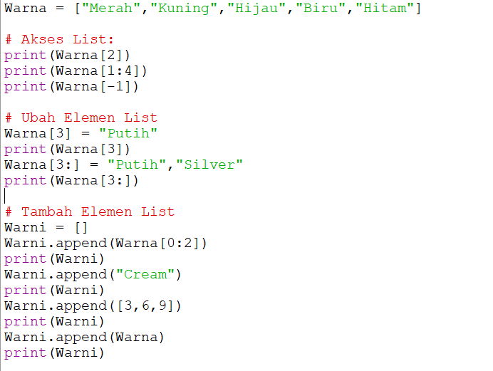
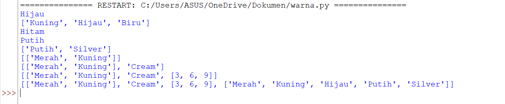
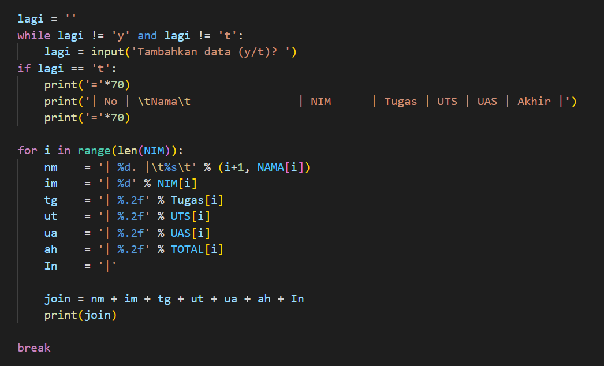
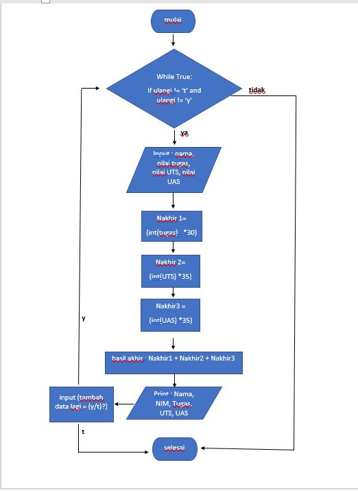

# Praktikum5 Aditya Putra Wijaya

# Latihan 5
### Buatlah sebuah list sebanyak 5 elemen dengan nilai bebas

#### Akses List:
- Tampilkan elemen ke 3
- Ambil nilai ke 2 sampai ke 4
- Ambil elemen terakhir

#### Ubah Elemen List
- Ubah elemen ke 4 dengan nilai lainnya
- Ubah elemen ke 4 dengan elemen terakhir

#### Tambah Elemen List
- Ambil 2 bagian dari list pertama (A) dan jadikan list ke 2 (B)
- Tambah list (B) dengan nilai string
- Tambah list (B) dengan 3 nilai
- Gabungkan list (B) dengan list (A)

## Setelah di Run 

# Tugas Praktikum
### Buatlah program sederhana untuk menambahkan data kedalam sebuah list dengan rincian:
- Program meminta memasukan data sebanyak mungkin (menggunakan perulangan)
- Tampilkan sebuah pilihan untuk menambahkan data ^(y/t)*, apabila jawaban T (tidak), maka program akan secara langsung menampilkan daftar datanya
- Nilai akhir diambil dari perhitungan 3 komponen nilai (tugas : 30%, UTS : 35%, UAS : 35%)
- Kemudian dibawah ini adalah langkah-langkah dalam pembuatan program

### Langkah- Langkah
- Pertama kita membuat list terlebih dahulu
- setelah sudah membuat list pada variabel di atas kita akan membuat program perulangan agar kita dapat memasukan data sebanyak banyaknya
- Membuat program pilihan (y/t), yaitu ketika kita menginputkan Y, maka kita akan diminta untuk mengisikan data kembali. Namun ketika kita menginputkan T, maka program akan berakhir dengan menampilkan hasil inputan data yang telah kita buat
- Kita juga dapat membuat tabel menggunakan performatan string agar terlihat lebih rapih

- Hasil dari program yang telah dibuat ditampilkan/diekspresikan dan akan jadi seperti di bawah ini ketika sudah di jalankan (Run):
## Tampilan Program

