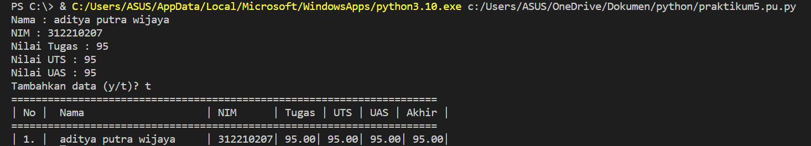

# Praktikum5 Aditya Putra Wijaya

#3 Latihan 5
### Buatlah sebuah list sebanyak 5 elemen dengan nilai bebas

#### Akses List:
- Tampilkan elemen ke 3
- Ambil nilai ke 2 sampai ke 4
- Ambil elemen terakhir

#### Ubah Elemen List
- Ubah elemen ke 4 dengan nilai lainnya
- Ubah elemen ke 4 dengan elemen terakhir

#### Tambah Elemen List
- Ambil 2 bagian dari list pertama (A) dan jadikan list ke 2 (B)
- Tambah list (B) dengan nilai string
- Tambah list (B) dengan 3 nilai
- Gabungkan list (B) dengan list (A)

# Setelah di Run

# Tugas Praktikum

